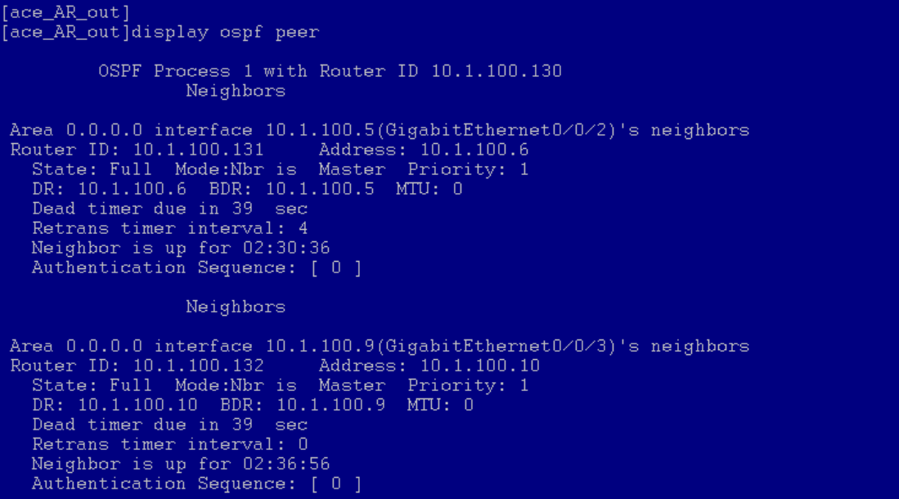
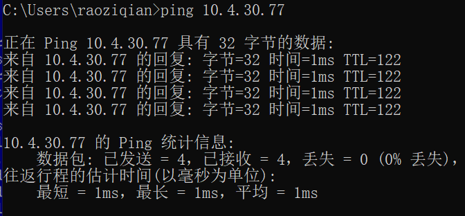

# 接入层  
- vlan隔离
- access 和 trunk 
```
display vlan  # 查看vlan配置
```
## ace_access_SW_1 


## ace_access_SW_2


# 汇聚层
- 两层网络到三层网络
- vlan 和 vlanif
- IP接口配置
- OSPF 发布路由

```
disp vlan 
disp interface ip brief
```
## ace_converge_SW_1


```
display ospf peer # 分析邻居状态
display ospf routing # 查看OSPF路由
display ip routing # 查看全部的路由
```


```
# 查看 DHCP 地址分配
display ip pool interface vlanif10
```


## ace_converge_SW_2
```
# 查看vlan配置
display vlan 
# 端口 ip配置
display ip interface brief
```


```
# OSPF 
display ospf peer
display ospf routing
display ip routing 
```


```
# 查看 DHCP 地址池信息
display ip pool inter vlanif30
```


# 核心层
- 接口IP配置
- OSPF路由发布
- 环路
## ace_Kernel_SW_1
```
[]disp vlan
[]display ip interface brief
```


```
# 检验
[] display ospf peer
[] display ospf routing 
[] display ip routing 
```


## ace_Kernel_SW_2
```
# 检验
[]disp vlan
[]display ip interface brief
```


```
# 检验
[] display ospf peer
[] display ospf routing 
[] display ip routing 
```


# 出口层 

- 接口IP配置 
- OSPF路由发布 
- NAT 
- 缺省静态路由
- 防火墙设置
- VPN L2TP

## ace_AR_out
```
# 查看 ip 配置
[] display ip interface brief
```


```
# 检验
[] display ospf peer
[] display ospf routing 
[] display ip routing 
```




## NAT 
```
display nat outbound
[AR4-GigabitEthernet0/0/1]disp nat session all
# 查看 私网、公网 的 mapping 关系，例如
display nat session all 
display nat session source <ip address>
```


## 防火墙 ping测试（ACL 过滤）
- 内网 PC ping 外网
- 外网 ping 内网 ip 地址

启动防火墙，采用了ACL 3102 规则


具体可见 VPN 测试中PING测试，和运营商路由器对内部的PING测试，限制了对摄像头的访问


# WAN层（运营商路由器）
- 接口IP配置 
- 静态路由配置

```
display  ip interface brief 
```


```
disp ip routing
```


这里也配置缺省静态路，通向共享网络
上图为BGP配置之前的截图，未显示BGP配置后相关的路由，但关于BGP路由，在其他交换机的路由表上可见一斑。

# 内网的 ping 测试

## 静态主机（10.1.2.2）ping ~

`ping 10.1.1.61`


`ping 10.1.101.230`


## 动态主机（10.1.101.230） ping~

`ping 10.1.2.2`


`ping 10.1.1.61`


能够互通，内网PC之间可以互通。 

下面是一些交换机对内网的一些ping测试


## ace_converge_SW_1 

`ping 10.1.1.61`


`ping 10.1.2.2`


`ping 10.1.101.230`


## ace_Kernel_SW_1 ping ~

`ping 10.1.2.2`


`ping 10.1.101.230`


`ping 10.1.1.61`


## ace_Kernel_SW_2  ping ~

`ping 10.1.2.2`


`ping 10.1.1.61`


`10.1.101.230`


## ace_AR_out  ping ~

`ping 10.1.2.2`


`ping 10.1.101.230`


`ping 10.1.1.61`


# 共享网络后设备上网

[ Windows：配置多网卡路由表（规则）](https://blog.csdn.net/test1280/article/details/90142359)

在共享主机上需要配置相关的路由

```
# 进入管理员权限
[windows] route print -4
# 将默认路由规则清空
[windows] route delete 0.0.0.0 
# 添加默认路由规则，指向外网网关。【访问外网】
[windows] route add 0.0.0.0 mask 0.0.0.0 10.203.128.1
# 添加普通路由规则，指向内网网关。【访问内网】
[windows] route add 10.1.0.0 mask 255.255.0.0 192.168.137.2
[windows] route add 100.1.0.0 mask 255.255.0.0 192.168.137.2
```


有两条 缺省路由表项，导致冲突，需要我们手动更改配置。


## 静态主机上网

`ping www.baidu.com`


## 动态主机上网

`ping www.baidu.com`


# 防火墙测试

`ping 10.1.2.1`

静态主机不通


`ping 10.1.1.1`


# VPN  测试


# BGP测试

我们是 group1 ping group2 

可以访问动态主机，不能访问静态主机




查看 group2 ping 我们小组的情况，查看是否进行了BGP过滤

ping  DHCP 获取的IP地址


PING 内网任一组网网段 IP

