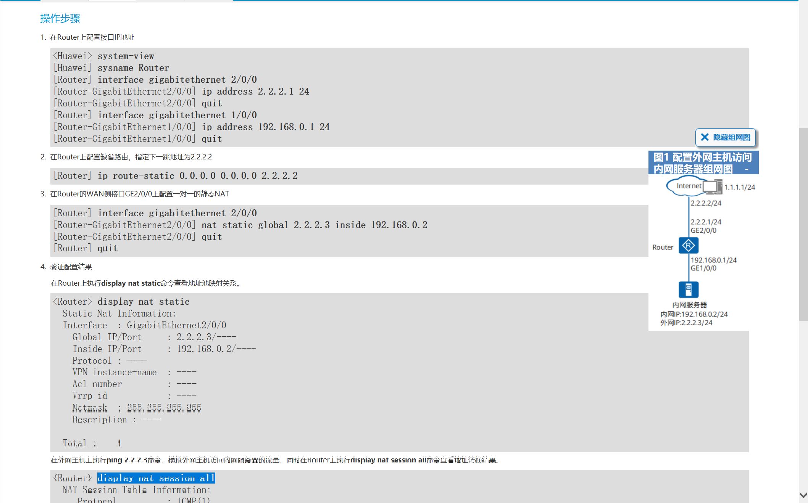
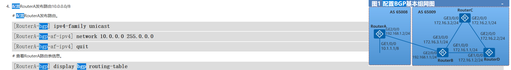
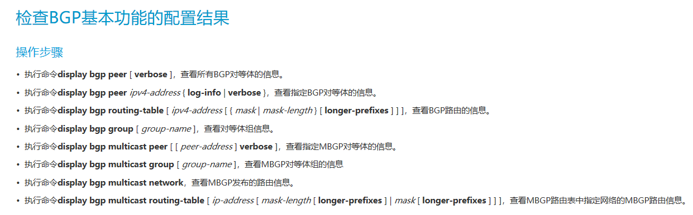
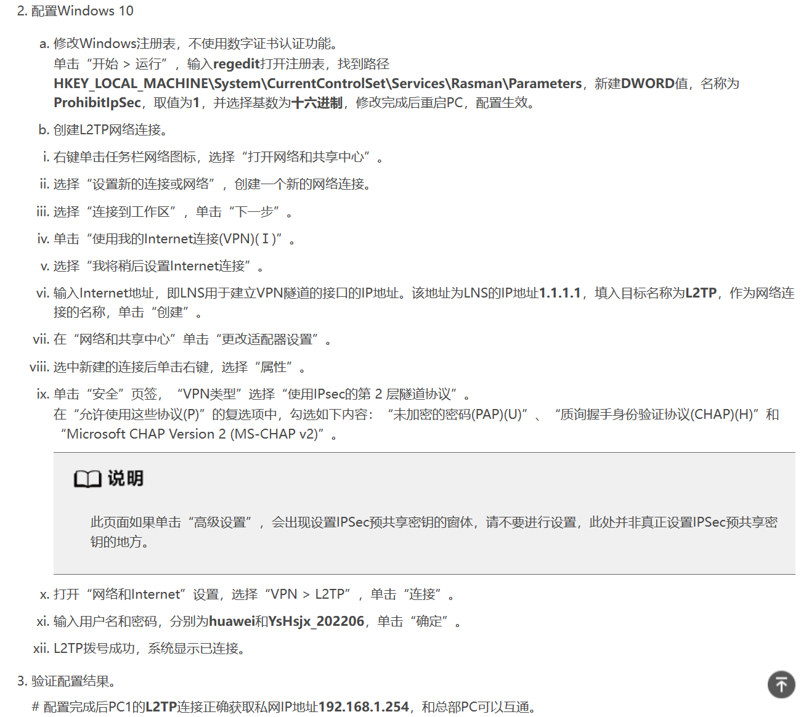
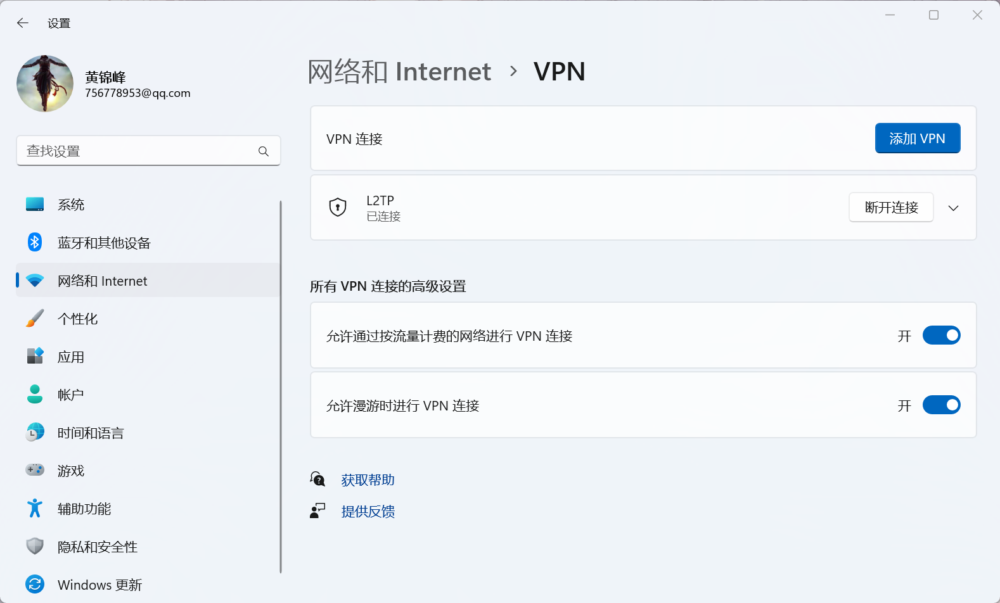
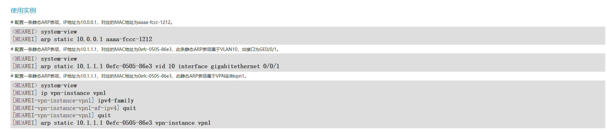

# 切换与保存保存
```
# 切换起始文件,为默认的文件
<HUAWEI>startup saved-configuration admintemp.cfg
<HUAWEI>reboot fast

# 保存与备份
<HUAWEI> save xxx.cfg //将当先配置保存进 flash:/ xxx.cfg
<HUAWEI> copy xxx.cfg xxxbk.cfg   //备份一下
```


# 检验
```
# 查看vlan配置  
display vlan
# 端口 ip配置 
display ip interface brief 
# 查看 DHCP 地址池信息
display ip pool interface vlanif30
# OSPF 配置
display ospf peer
display ospf routing
# 查看路由表
display ip routing
display ospf lsdb

```

# 可维护性
```
display ip interface brief # 观察物理接口是否为 up 检查网线连接问题
```

# 接入层
## ace_access_SW_1
开启vlan 10 20 对应的端口进行划分
```
[] vlan batch 10 20

# 配置 1 号端口 vlan trunk 10 20
[] interface gigabitethernet 0/0/1 //进入接口视图
[0/0/1] port link-type trunk //配置 trunk 类型
[0/0/1] port trunk allow-pass vlan 10 20//允许接口上VLAN 10 20通过
[0/0/1] quit

# 配置 2 号端口 vlan access 10
[] interface gigabitethernet 0/0/2 //进入接口视图
[0/0/2] port link-type access //配置 access 类型
[0/0/2] port default vlan 10 //配置
[0/0/2] quit

# 配置 3 号端口 vlan access 20
[]interface gigabitethernet 0/0/3
[0/0/3]port link-type access 
[0/0/3]port default vlan 20
[0/0/3]quit
```

## ace_access_SW_2
```
[]vlan batch 30

# 配置 1 号端口 vlan trunk 30
[]interface gigabitethernet 0/0/1
[0/0/1]port link-type trunk
[0/0/1]port trunk allow-pass vlan 30
[0/0/1]quit

# 配置 2 号端口 vlan access 30
[]interface gigabitethernet 0/0/2
[0/0/2]port link-type access
[0/0/2]port default vlan 30
[0/0/2]quit
```

# 汇聚层
## ace_converge_SW_1
### vlan & vlanif
```
[] vlan batch 10 20 300 500 #交换机上全局开启 VLAN 资源

# access 配置
[] interface gigabitethernet 0/0/2 #接PC机接口设置access接口，配置缺省 VLAN
[0/0/2] port link-type access #配置 access 类型
[0/0/2] port default vlan 300 #配置缺省 VLAN，VLAN300 关联该端口
[0/0/2] quit

[] interface gigabitethernet 0/0/3 #接PC机接口设置access接口，配置缺省 VLAN
[0/0/3] port link-type access #配置 access 类型
[0/0/3] port default vlan 500 #配置缺省 VLAN，VLAN300 关联该端口
[0/0/3] quit

# trunk 配置
[] interface gigabitethernet 0/0/1
[0/0/1] port link-type trunk //配置 trunk 类型
[0/0/1] port trunk allow-pass vlan 10 20//允许接口上VLAN 10 20 通过
[0/0/1] quit


# vlanif配置
#与接入层ace_access_SW_1连接的端口
#对应的 VLAN 上启用三层
[] interface vlanif 10
[Vlanif10] ip address 10.1.1.1 24
[Vlanif10] quit

[] interface vlanif 20
[Vlanif20] ip address 10.1.2.1 24
[Vlanif20] quit

#与核心层ace_Kernel_SW_1连接的端口
#对应的 VLAN 上启用三层
[] interface vlanif 300
[Vlanif300] ip address 10.1.100.14 30
[Vlanif300] quit

#与核心层ace_Kernel_SW_2连接的端口，
#对应的 VLAN 上启用三层
[] interface vlanif 500
[Vlanif500] ip address 10.1.100.22 30
[Vlanif500] quit
```

### DHCP配置
```
# 使能 DHCP Server.
[] dhcp enable
# 配置 DHCP 地址池相关信息，已经配置了接口 IP 地址，在此配置基础上增加地址池配置：
[] interface vlanif 10
# 选择本 VLANIF 接口网段作为 DHCP server 分配的 IP 地址池网段
[Vlanif10] dhcp select interface
# 可选，设置 DHCP 分配的网关地址。
[Vlanif10] dhcp server gateway-list 10.1.1.1 //不配置时会自动选择该接口的 ip 地址作为网关地址。
# 设置 DHCP 分配的 DNS 服务器地址。
[Vlanif10] dhcp server dns-list 114.114.114.114 //可尝试
```

### OSPF配置
```
# 交换机上启用 OSPF 并发布路由
# 配置 ospf router-id ，作为 OSPF 路由器标识。Router-id 网络里唯一，不能冲突
[]interface loopback 0
[Loopback0] ip address 10.1.100.133 255.255.255.255

#启动 OSPF 服务
[] ospf 1 router-id 10.1.100.133 //1 的作用是进程号

#配置 OSPF area，本实验仅部署 area 0
[ospf-1] area 0

#与路由器间接口上使能 OSPF，并把这个的接口链路状态发布出去.注意反掩码
[ospf-1-area-0.0.0.0] network 10.1.100.12 0.0.0.3
[ospf-1-area-0.0.0.0] network 10.1.100.20 0.0.0.3
[ospf-1-area-0.0.0.0] network 10.1.1.0 0.0.0.255
[ospf-1-area-0.0.0.0] network 10.1.2.0 0.0.0.255
[ospf-1-area-0.0.0.0] quit
[ospf-1] import-route direct
```

## ace_converge_SW_2
- vlan、vlanif 
- OSPF 
- DHCP 

### vlan & vlanif 
```
[] vlan batch 30 400 600

# 1号接口配置Trunk
[]interface gigabitethernet 0/0/1
[] interface gigabitethernet 0/0/1
[0/0/1] port link-type trunk //配置 trunk 类型
[0/0/1] port trunk allow-pass vlan 30//允许接口上VLAN 30 通过
[0/0/1] quit

# 2 3号接口配置access
[] interface gigabitethernet 0/0/2 #接口设置access接口，配置缺省 VLAN
[0/0/2] port link-type access //配置 access 类型
[0/0/2] port default vlan 400 //配置缺省 VLAN，VLAN400 与这个端口关联
[0/0/2] quit

[] interface gigabitethernet 0/0/3
[0/0/3] port link-type access //配置 access 类型
[0/0/3] port default vlan 600 //配置缺省 VLAN，VLAN400 与这个端口关联了
[0/0/3] quit

# vlanif 配置
[] interface vlanif 30 #设置vlanif
[Vlanif30] ip address 10.1.101.1 24 #设置ip地址
[Vlanif30] quit

[] interface vlanif 400
[Vlanif400] ip address 10.1.100.18 30
[Vlanif400] quit

[] interface vlanif 600
[Vlanif600] ip address 10.1.100.26 30
[Vlanif600] quit

# 检验
[] display vlan 
[] display ip interface brief 
```

### DHCP
```
[] dhcp enable
[] interface vlanif 30
[Vlanif30] dhcp select interface
# 可选，设置 DHCP 分配的网关地址。
[Vlanif30] dhcp server gateway-list 10.1.101.1 #设置 DHCP 分配的 DNS 服务器地址。
[Vlanif30] dhcp server dns-list 114.114.114.114
[Vlanif30] quit

# 检验
[] display ip pool interface vlanif30
```

### OSPF 
```
[] interface loopback 0
[LoopBack0] ip address 10.1.100.134 255.255.255.255
[LoopBack0] ospf 1 router-id 10.1.100.134
[ospf-1] area 0
#与路由器间接口上使能 OSPF，并把这个的接口链路状态发布出去.注意反掩码 
[ospf-1-area-0.0.0.0] network 10.1.100.16 0.0.0.3
[ospf-1-area-0.0.0.0] network 10.1.100.24 0.0.0.3
[ospf-1-area-0.0.0.0] network 10.1.101.0 0.0.0.255

# 检验
[] display ospf peer
[] display ospf routing 
[] display ip routing
```


# 核心层
## ace_Kernel_SW_1
```
[] vlan batch 100 300 400     //启用 vlan 200 500 
#配置各个端口的 ip
[] interface gigabitethernet 0/0/1
[0/0/1] port link-type access
[0/0/1] port default vlan 100

[]interface gigabitethernet 0/0/2
[0/0/2] port link-type access
[0/0/2] port default vlan 300

[]interface gigabitethernet 0/0/3
[0/0/3] port link-type access
[0/0/3] port default vlan 400

# 绑定 ip 地址
[] interface vlanif 100
[Vlanif200] ip address 10.1.100.6 30
[Vlanif200] quit

[] interface vlanif 300
[Vlanif500] ip address 10.1.100.13 30
[Vlanif500] quit

[] interface vlanif 400
[Vlanif600] ip address 10.1.100.17 30
[Vlanif600] quit

# 检验
[]disp vlan
[]display ip interface brief
```

```
[] interface loopback 0
[] ip address 10.1.100.131 255.255.255.255
[] ospf 1 router-id 10.1.100.131

#配置 OSPF area，本实验仅部署 area 0
#与路由器间接口上使能 OSPF，并把这个的接口链路状态发布出去.
[ospf-1] area 0
注意反掩码
[ospf-1-area-0.0.0.0] network 10.1.100.6 0.0.0.3
[ospf-1-area-0.0.0.0] network 10.1.100.13 0.0.0.3
[ospf-1-area-0.0.0.0] network 10.1.100.17 0.0.0.3

# 检验
[] display ospf peer 
[] display ospf routing 
[] display ip routing 
```

### 环路
```
undo stp enable
```

## ace_Kernel_SW_2
### 改名
```
<> system-view
[] sysname ace_Kernel_SW_2     //改名
```

### vlan & vlanif
```
[] vlan batch 200 500 600     //启用 vlan 200 500 
#配置各个端口的 ip
[] interface gigabitethernet 0/0/1
[0/0/1] port link-type access
[0/0/1] port default vlan 200

[]interface gigabitethernet 0/0/2
[0/0/2] port link-type access
[0/0/2] port default vlan 500

[]interface gigabitethernet 0/0/3
[0/0/3] port link-type access
[0/0/3] port default vlan 600

# 绑定 ip 地址
[] interface vlanif 200
[Vlanif200] ip address 10.1.100.10 30
[Vlanif200] quit

[] interface vlanif 500
[Vlanif500] ip address 10.1.100.21 30
[Vlanif500] quit

[] interface vlanif 600
[Vlanif600] ip address 10.1.100.25 30
[Vlanif600] quit

# 检验
[]disp vlan
[]display ip interface brief
```

### ospf
```
[] interface loopback 0
[] ip address 10.1.100.132 255.255.255.255
[] ospf 1 router-id 10.1.100.132

#配置 OSPF area，本实验仅部署 area 0
#与路由器间接口上使能 OSPF，并把这个的接口链路状态发布出去.
[ospf-1] area 0
注意反掩码
[ospf-1-area-0.0.0.0] network 10.1.100.8 0.0.0.3
[ospf-1-area-0.0.0.0] network 10.1.100.20 0.0.0.3
[ospf-1-area-0.0.0.0] network 10.1.100.24 0.0.0.3

# 检验
[] display ospf peer 
[] display ospf routing 
[] display ip routing 

```

### 环路
```
undo stp enable
```


# 出口层 
## ace_AR_out
- 路由器设置缺省静态路由指向运营商出口
- 出口路由器与核心交换启动OSPF
- 缺省路由通过OSPF发布到内网中 

### ip 配置
ip 地址承接 需不需要 vlan 来？
```
<> system-view 
[] sysname ace_AR_out
[] interface gigabitethernet 0/0/1
[0/0/1] undo portswitch 
[0/0/1] ip address 100.1.100.30 30
[0/0/1] quit

[] interface gigabitethernet 0/0/2
[0/0/2] undo portswitch  
[0/0/2] ip address 10.1.100.5 30
[0/0/2] quit

[] interface gigabitethernet 0/0/3
[0/0/3] undo portswitch
[0/0/3] ip address 10.1.100.9 30
[0/0/3] quit

# 查看 ip 配置
[] display ip interface brief
```

### ospf
```
[] interface loopback 0
[] ip address 10.1.100.130 255.255.255.255
[] ospf 1 router-id 10.1.100.130

# 配置 OSPF area，本实验仅部署 area 0
# 与路由器间接口上使能 OSPF，并把这个的接口链路状态发布出去.
[ospf-1] area 0
# 将下面两个接口的路由发布出去，注意反掩码
[ospf-1-area-0.0.0.0] network 10.1.100.4 0.0.0.3
[ospf-1-area-0.0.0.0] network 10.1.100.8 0.0.0.3
```


### 路由器设置缺省静态路由指向运营商出口
属于不同网段的主机通过几台Router相连，要求不配置动态路由协议，实现不同网段的任意两台主机之间能够互通。

```
[ace_AR_out] ip route-static 0.0.0.0 0.0.0.0 100.1.100.29 //下一跳地址

# 对应的 WAN 需要回来 的静态路由，！！！这里有问题！！！NAT地址转化了
[ace_AR_wan] ip route-static 100.1.100.0 255.255.255.0 100.1.100.30 
[ace_AR_wan] ip route-static 100.1.1.0 255.255.255.0 100.1.100.30  
[ace_AR_wan] ip route-static 100.1.2.0 255.255.255.0 100.1.100.30 
[ace_AR_wan] ip route-static 100.1.101.0 255.255.255.0 100.1.100.30 
# 实现防火墙功能时，进入内网的网段
[ace_AR_wan] ip route-static 100.1.100.0 255.255.255.0 10.1.100.30 
[ace_AR_wan] ip route-static 100.1.1.0 255.255.255.0 10.1.100.30  
[ace_AR_wan] ip route-static 100.1.2.0 255.255.255.0 10.1.100.30 
[ace_AR_wan] ip route-static 100.1.101.0 255.255.255.0 10.1.100.30 


# 配置OSPF将缺省路由通告到OSPF路由区域 
[] ospf 1 router-id 10.1.100.130
[ospf-1] default-route-advertise always

# 验证：显示RouterA的IP路由表
[] display ip routing-table 
# ping 命令验证连通性
# 使用**Tracert**命令验证连通性，可以查看通过的路由 
```


### NAT
这里值得思考一下，是不是出去了就是 东大的网络了  
acl 编号 使用 2001 开始编号吧，之后还有防火墙的编号，不能搞混了 
映射的地址？
10.1.100.0   ->       100.1.100. 200 ~ 100.1.100.254
10.1.1.0       ->       100.1.1.1~100.1.1.254
10.1.2.0      ->       100.1.2.1~100.1.2.254
10.1.101.0   ->       100.1.101.1~100.1.101.254
```
[] nat address-group 1 100.1.100.200 100.1.100.254 // 映射出去的网段
[] acl 2001
[acl-basic-2001] rule 5 permit source 10.1.100.0 0.0.0.255 // 10.1.100.0/24
[acl-basic-2001] quit

[] nat address-group 2 100.1.1.1 100.1.1.254 // 映射出去的网段
[] acl 2002
[acl-basic-2002] rule 5 permit source 10.1.1.0 0.0.0.255 // 10.1.1.0/24
[acl-basic-2002] quit

[] nat address-group 3 100.1.2.1 100.1.2.254 // 映射出去的网段
[] acl 2003
[acl-basic-2003] rule 5 permit source 10.1.2.0 0.0.0.255 // 10.1.2.0/24
[acl-basic-2003] quit

[] nat address-group 4 100.1.101.1 100.1.101.254 // 映射出去的网段
[] acl 2004
[acl-basic-2004] rule 5 permit source 10.1.101.0 0.0.0.255 // 10.1.101.0/24
[acl-basic-2004] quit

[] interface gigabitethernet 0/0/1
[GigabitEthernet0/0/1] nat outbound 2001 address-group 1 
[GigabitEthernet0/0/1] nat outbound 2002 address-group 2 
[GigabitEthernet0/0/1] nat outbound 2003 address-group 3
[GigabitEthernet0/0/1] nat outbound 2004 address-group 4
[GigabitEthernet0/0/1] quit
```

如果需要在Router上执行 **ping -a_source-ip-address** 命令通过指定发送ICMP ECHO-REQUEST报文的源IP地址来验证内网用户可以访问Internet，需要配置命令 **ip soft-forward enhance enable** 使能设备产生的控制报文的增强转发功能，否则会ping不通

验证配置结果 
```
[] display nat outbound
# 在Router上执行命令**ping**，验证内网可以访问Internet
ping -a 192.168.20.1 2.2.2.2

# 在NAT表项老化时间到期前，在Router上执行命令**display nat session all**，查看地址转换结果。
display nat session all
display nat session source <ip address>

```




==连接上电脑测试一下在未过滤时能不能ping 通内部网络==


### 共享网络

- 将wan 设置成共享
- 设置有线网卡ip地址，选择以太网，右键属性->internet协议版本4(TCP/IPV4)->属性，配置ip，子网掩码DNS服务器，地址选择WLAN中的DNS服务器ip地址，否则无法打开网页。双击WLAN- DNS服务器，地址选择WLAN中的DNS服务器ip地址，否则无法打开网页。双击WLAN->详细信息来查看DNS服务器地址。

- 设置另一台电脑有线网卡的ip地址，过程同上。ip地址要在同一局域网内 192.128.137.xxx (xxx为1到255的任意数值)，默认网关选择共享网卡的ip地址192.168.137.1，DNS服务器ip地址同共享网卡ip地址

在这里，我们另一台电脑可是 AR 啊，怎么办？设置静态路由呗， 直接给我跳到，共享网络去，
静态路由怎么配？
```
# 配置一个缺省的静态路由怎么样？
[AR_wan] ip route-static 0.0.0.0 0.0.0.0 100.1.201.2 //下一跳地址
[] ospf 1 router-id 10.1.100.129
[ospf-1] default-route-advertise always
```

在 Windows 电脑上也要配置路由规则
[ Windows：配置多网卡路由表（规则）](https://blog.csdn.net/test1280/article/details/90142359)
```
[windows] route print -4

1）
命令：route delete 0.0.0.0
作用：将默认路由规则清空。

2）
命令：route add 0.0.0.0 mask 0.0.0.0 192.168.43.1
作用：添加默认路由规则，指向外网网关。【访问外网】

3）
命令：route add 192.168.0.0 mask 255.255.0.0 192.168.25.1
作用：添加普通路由规则，指向内网网关。【访问内网】
```

### ACL包过滤防火墙功能
1.  在Router上配置安全区域和安全域间。 
```
# 配置安全区域和安全域间
[Huawei] firewall zone trust
[Huawei-zone-trust] priority 14
[Huawei-zone-trust] quit

[Huawei] firewall zone untrust
[Huawei-zone-untrust] priority 1
[Huawei-zone-untrust] quit

[Huawei] firewall interzone trust untrust
[Huawei-interzone-trust-untrust] firewall enable
[Huawei-interzone-trust-untrust] quit


[Huawei] interface gigabitethernet 0/0/2 // 2 号交换机区域
[Huawei-GigabitEthernet0/0/2] zone trust
[Huawei-GigabitEthernet0/0/2] quit

[Huawei] interface gigabitethernet 0/0/3 // 3 号交换机区域
[Huawei-GigabitEthernet0/0/3] zone trust
[Huawei-GigabitEthernet0/0/3] quit

[Huawei] interface gigabitethernet 0/0/1 // 外网非信任区域
[Huawei-GigabitEthernet0/0/1] ip address 100.1.100.30 30  
[Huawei-GigabitEthernet0/0/1] zone untrust
[Huawei-GigabitEthernet0/0/1] quit
```


在router上配置ACL 
100.1.0.0 /16
外部主机可以到达的地方为：10.1.1.0           10.1.101.0
反掩码
```
[]acl 3102
[acl-adv-3102] rule permit ip source 100.1.0.0 0.0.255.255 destination 10.1.1.0  0.0.0.255  //vlan10
[acl-adv-3102] rule permit ip source 100.1.0.0 0.0.255.255 destination 10.1.101.0  0.0.0.255 //vlan30

[acl-adv-3102] rule permit ip destination 100.1.1.0  0.0.0.255  //vlan10
[acl-adv-3102] rule permit ip destination 100.1.101.0  0.0.0.255 //vlan30

[acl-adv-3102] rule deny ip
[acl-adv-3102] quit
```

```
[huawei] acl number 3103
[huawei-acl-adv-2000] rule deny ip source 10.1.2.0 0.0.0.255 destination any
[huawei-acl-adv-2000] quit

```
 
在Router上配置包过滤。 这里是防火墙的配置，还可以在端口直接
 ```
[huawei] firewall interzone trust untrust
[huawei-interzone-trust-untrust] firewall enable
[huawei-interzone-trust-untrust] packet-filter 3102 inbound
[huawei-interzone-trust-untrust] packet-filter 3103 outbound // 添加 ACL
[huawei-interzone-trust-untrust] quit

```

验证配置结果。
```
在Router上执行**display firewall interzone** [ _zone-name1_ _zone-name2_ ]命令，结果如下。

[Huawei] display firewall interzone trust untrust
```

内网 PC 机可以上网，外网可以 ping 10.1.1.1 & 10.1.101.1

### BGP 策略

一根线连接 着两个 出口层的 router 
设我们这段我为 ipA，对面（下一跳）为ipB， 要在统一网段哦
我们这里的router-id 是 10.1.100.130

我们的编号为 65001 
与第四组相连，65004，100.4.20.1/24

配置 g0/0/4 ip：
100.4.20.2/24
```
[] interface gigabitethernet 0/0/1。
[0/0/4] ip address 100.1.100.30 30
```

```
# 标识自己
[AR_1] bgp 65001 // 自治系统号，我们是第一组
[AR_1-bgp] router-id 10.1.100.130 

# 找到对方路由器，配置EBGP连接
[AR_1-bgp] peer [ipB] as-number 65002 //对端 IP 地址，对端自治系统号

eg:[AR_1-bgp] peer 100.4.20.1 as-number 65004

# 查看对等体的连接状态
[AR_1-bgp] display bgp peer

# 引入路由，对外发布。路由协议可以引入多种其他的路由协议，比如 static 静态路由，direct 直连路
由,ospf 路由等。可以根据现网应用情况选择。
[AR_1-bgp] ipv4-family unicast
[AR_1-bgp-af-ipv4] import-route direct //引入直连路由
[AR_1-bgp-af-ipv4] import-route ospf 1 //引入 OSPF 路由
[AR_1-bgp] quit

AR1 OSPF 引入 BGP 路由
[AR_1] ospf 
[AR_1-ospf-1] import-route bgp

# 测试
[] display bgp routing-table 

```



查看文档 《配置邻居按需发布路由》 


- 使用BGP 策略过滤不符合规则路由
	- 两校区间 PC机间可以互访
	- 两校区间 摄像头间不能互访

#### 配置地址前缀列表
##### 操作步骤
当需要根据路由的目的地址控制路由的发布和接收时，配置地址前缀列表。
1.  配置IPv4地址前缀列表
    1.  执行命令**system-view**，进入系统视图。
    2.  执行命令**ip ip-prefix** _ip-prefix-name_ [ **index** _index-number_ ] { **permit** | **deny** } _ipv4-address_ _mask-length_ [ **match-network** ] [ **greater-equal** _greater-equal-value_ ] [ **less-equal** _less-equal-value_ ]，配置IPv4地址前缀列表。

#### 配置邻居按需发布路由
##### 操作步骤

1.  执行命令**system-view**，进入系统视图。
2.  执行命令**bgp** { _as-number-plain_ | _as-number-dot_ }，进入BGP视图。
3.  执行命令**ipv4-family** **unicast**，进入IPv4单播地址族视图。
4.  执行命令**peer** { _group-name_ | _ipv4-address_ } **ip-prefix** _ip-prefix-name_ **import**，配置对等体/对等体组基于IP前缀列表的入口路由过滤策略。
5.  执行命令**peer** { _group-name_ | _ipv4-address_ } **capability-advertise orf** [ **non-standard-compatible** ] **ip-prefix** { **both** | **receive** | **send** }，配置BGP对等体（组）使能基于地址前缀的ORF功能。
6. 缺省情况下，未使能BGP对等体（组）基于地址前缀的ORF功能。


```
# 使用地址前缀来进行过滤
[] ip ip-prefix myfilter deny 10.1.2.0 24
[] ip ip-prefix myfilter permit 0.0.0.0 0 less-equal 32
[] peer [ipB] as-number 65002
[bgp] ipv4-family unicast myprefix import

```

使用下面的代码，不让内网网段的数据流出
```
[huawei] ip ip-prefix myfilter deny 10.1.2.0 24
[huawei] route-policy mypolicy deny node 10
[huawei-route-policy-mypolicy-10] apply ip-prefix myfilter
[huawei-route-policy-mypolicy-10] quit
[huawei] bgp 65001
[huawei-bgp] peer 100.4.20.1 route-policy mypolicy export
[huawei-bgp] quit
```


#### ACL包过滤

```
# 通过filter-policy来进行过滤
配置ACL列表 --- 在BGP中调用过滤策略时，他只能调用ACL列表，所以我们必须使用ACL列表来抓取流量
[] acl 2000
[acl-basic-2000]rule deny source 10.1.2.0 0.0.0.255
[acl-basic-2000]rule permit source any
# 2，在BGP进程中调用
[] bgp 65001
[bgp]peer 100.4.20.1 filter-policy 2000 export // 这里的12.0.0.1是什么
```
[Router-GigabitEthernet0/0/1] nat outbound 2004 address-group 4

直接在 interface 上进行设置
```
[huawei] acl number 2000
[huawei-acl-adv-2000] rule deny ip source 10.1.2.0 0.0.0.255 destination any
[huawei-acl-adv-2000] quit

[huawei] interface GigabitEthernet 0/0/4
[huawei-GigabitEthernet0/0/1] ip address 100.4.20.2
[huawei-GigabitEthernet0/0/1] traffic-filter outbound acl 2000 //主要是这个
[huawei-GigabitEthernet0/0/1] quit
```


### VPN
部署L2TP VPN，使用windows自带客户端，VPN接入网络

```
# 配置L2TP用户的用户名为**huawei**，密码为**123**，用户类型固定为**ppp**
[] aaa
[-aaa] local-user huawei password 
123
123
[aaa] local-user huawei service-type ppp
[aaa] q

# 定义一个地址池，为拨入用户分配地址。
[LNS] ip pool lns
[LNS-ip-pool-lns] network 10.1.200.0 mask 24
[LNS-ip-pool-lns] gateway-list 10.1.200.1
[LNS-ip-pool-lns] quit

# 配置虚拟接口模板
[LNS] interface virtual-template 1
[LNS-Virtual-Template1] ip address 10.1.200.1 255.255.255.0
[LNS-Virtual-Template1] ppp authentication-mode chap
[LNS-Virtual-Template1] remote address pool lns 
[LNS-Virtual-Template1] quit

# 使能L2TP功能，并创建L2TP组编号为**1**。    
[LNS] l2tp enable
[LNS] l2tp-group 1

# 禁止隧道认证功能，Windows 10不支持隧道认证。
[LNS-l2tp1] undo tunnel authentication
# 配置LNS绑定虚拟接口模板。
[LNS-l2tp1] allow l2tp virtual-template 1

```


对于已经有的，改一下设置就行



注意：隧道接口的ip 地址为 100.1.100.30
 


# WAN网络
## ace_AR_wan
### ip配置
```
<> system-view 
[] sysname ace_AR_wan
[] interface gigabitethernet 0/0/1

[0/0/1] undo portswitch 
[0/0/1] ip address 100.1.100.29 30
[0/0/1] quit

[] interface gigabitethernet 0/0/2
[0/0/2] undo portswitch  
[0/0/2] ip address 100.1.201.1 24
[0/0/2] quit

[] interface gigabitethernet 0/0/3
[0/0/3] undo portswitch
[0/0/3] ip address 10.1.202.1 24
[0/0/3] quit

[] interface loopback 0
[Loopback0] ip address 100.1.100.129 255.255.255.255
[Loopback0]quit

# 查看 ip 配置
[] display ip interface brief
```


### 进入内网的静态路由

受到 NET 地址转换 的影响
```
# 对应的 WAN 需要回来 的静态路由
[ace_AR_wan] ip route-static 100.1.100.0 255.255.255.0 100.1.100.30 
[ace_AR_wan] ip route-static 100.1.1.0 255.255.255.0 100.1.100.30  
[ace_AR_wan] ip route-static 100.1.2.0 255.255.255.0 100.1.100.30 
[ace_AR_wan] ip route-static 100.1.101.0 255.255.255.0 100.1.100.30 
# 实现防火墙功能时，进入内网的网段
[ace_AR_wan] ip route-static 100.1.100.0 255.255.255.0 10.1.100.30 
[ace_AR_wan] ip route-static 100.1.1.0 255.255.255.0 10.1.100.30  
[ace_AR_wan] ip route-static 100.1.2.0 255.255.255.0 10.1.100.30 
[ace_AR_wan] ip route-static 100.1.101.0 255.255.255.0 10.1.100.30 
```


# ARP 攻击
```
在别人的汇聚层交换机上，开始arp攻击 con 
所有访问静态PC，都失灵，packet 因为汇聚层交换机的叛变

在静态PC上
# 查看IP地址
ipconfig   //查看IP地址

在汇聚层交换机上
# 查看arp 映射表
disp display arp all 
清除静态ARP表项
reset arp all
配置一条假的 arp 表项
arp static 10.1.2.2 5489-9868-0ec2 vid 20 interface gigabitethernet 0/0/1
# vid 表示 vlan

# arp static 
# 在接入层交换机上 
[] arp static <ip地址> <改成自己端口的mac,欺骗一下> vlan20 gigabitethernet 0/0/1 

就把中间的Mac地址改变一下

arp static 10.1.2.2 5489-9868-0ec2 vid 10 interface gigabitethernet 0/0/1

```


