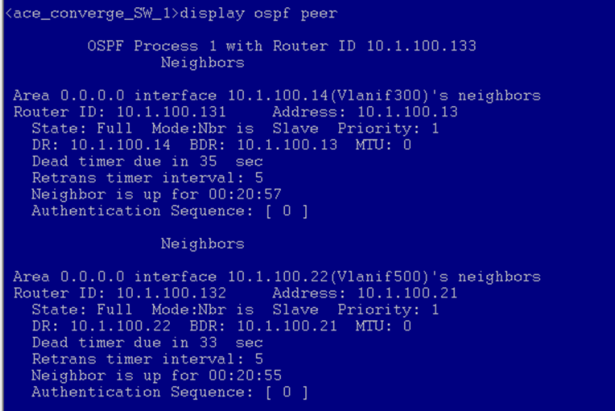
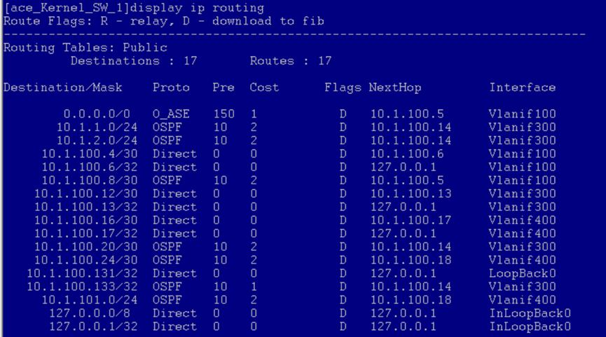

# 接入层 
```
display vlan //查看vlan配置
```
## ace_access_SW_1 
## ace_access_SW_2


# 汇聚层
```
disp vlan 
disp interface ip brief
```
## ace_converge_SW_1


```
display ospf peer
display ospf routing
display ip routing
```




## ace_converge_SW_2

配置了 vlan & vlanif ，DHCP，OSPF
```
# 查看vlan配置
display vlan 
# 端口 ip配置
display ip interface brief
# 查看 DHCP 地址池信息
display ip pool interface vlanif10
# OSPF 
display ospf peer
display ospf routing
display ip routing

```

# 核心层
## ace_Kernel_SW_1
```
[]disp vlan
[]display ip interface brief
```


```
# 检验
[] display ospf peer
[] display ospf routing 
[] display ip routing
```





## ace_Kernel_SW_2
```
# 检验
[]disp vlan
[]display ip interface brief
```


```
# 检验
[] display ospf peer
[] display ospf routing 
```


# 出口层 

设计到 内网 和 外网的 互通，
每一个阶段 配置完成后都需要 ping 通
## ace_AR_out
```
# 查看 ip 配置
[] display ip interface brief
```

```
# 检验
[] display ospf peer
[] display ospf routing 
[] display ip routing

# 验证：显示RouterA的IP路由表
[] display ip routing-table 
# ping 命令验证连通性
# 使用**Tracert**命令验证连通性，可以查看通过的路由 
```


## NAT 
```
display nat outbound
[AR4-GigabitEthernet0/0/1]disp nat session all
# 查看 私网、公网 的 mapping 关系，例如
display nat session all 
display nat session source <ip address>
```


## 防火墙 ping测试
打开wireshark抓包，
PC1、PC2、PC3  ping 外网
运营商路由器 ping PC1、PC2、PC3  的内网地址 & NAT 转化后的地址


**共享网络
实现网络的共享后，AR_wan 首先能上网了吧？ 
内网的 PC 应该也能上网了吧？
外网的 机器 通过 东大的wifi应该能 ping 通 内网的 对外 ip 地址
**

[ Windows：配置多网卡路由表（规则）](https://blog.csdn.net/test1280/article/details/90142359)

```

[windows] route print -4

1）
命令：route delete 0.0.0.0
作用：将默认路由规则清空。

2）
命令：route add 0.0.0.0 mask 0.0.0.0 192.168.43.1
作用：添加默认路由规则，指向外网网关。【访问外网】

3）
命令：route add 192.168.0.0 mask 255.255.0.0 192.168.25.1
作用：添加普通路由规则，指向内网网关。【访问内网】

```


## ACL 过滤规则

# WAN


# 内网的 ping 测试
## 静态主机（10.1.2.2）ping ~
ping 10.1.1.61


ping 10.1.101.230


## 动态主机（10.1.101.230） ping~

ping 10.1.2.2


ping 10.1.1.61


## ace_converge_SW_1 

ping 10.1.1.61


ping 10.1.2.2


ping 10.1.101.230


## ace_Kernel_SW_1 ping ~
ping 10.1.2.2


ping 10.1.101.230


ping 10.1.1.61


## ace_Kernel_SW_2  ping ~


## ace_AR_out  ping ~


在 ping 之前，将出口层有关的内网也配置好，开始
主要是  PC 机 对内网的 进行 ping ，
各个交换机也 自己 ping 一下 PC 
成功即可

PC1 ping PC2
PC1 ping PC3

PC2 ping PC2
PC2 ping PC3

PC3 ping PC2
PC3 ping PC3

等等


# 网络共享后设备上网
## 静态主机上网
Ping 百度：


## 动态主机上网
ping 百度


# 防火墙测试

ping 10.1.2.1


ping 10.1.1.1


# VPN  测试


# BGP测试